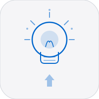

<div align="center">

# Spark



Idea-sharing platform with upvoting and JWT auth. Post sparks, vote on others, no framework required.

[spark.heyitsmejosh.com](https://spark.heyitsmejosh.com)

</div>


## Architecture


## Stack

- Vanilla HTML/JS (single `index.html`)
- Vercel serverless API
- Supabase PostgreSQL backend
- JWT authentication
- PWA support

## Deploy

No build step. Push to main, Vercel deploys automatically.

```bash
# local preview
npx serve .
```

## Roadmap

- [x] iOS companion app (spark-ios)
- [x] PWA support
- [x] Persistent database (Supabase)
- [ ] Real-time updates via Supabase Realtime
- [ ] Comment threads on posts
- [ ] User profiles with post history
- [ ] Topic tags and filtering
- [ ] Moderation tools
