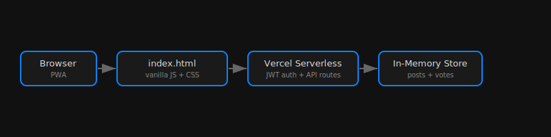

<div align="center">

# Spark


Idea-sharing platform with upvoting and JWT auth. Post sparks, vote on others, no framework required.

[spark.heyitsmejosh.com](https://spark.heyitsmejosh.com)

</div>

## Architecture



## Features

- **Vanilla JS** — Single `index.html`, no build step
- **JWT Auth** — Sign up, login, post ideas
- **Category Filters** — Tech, Business, Health, Productivity, Finance, Sustainability
- **Hot & New** — Sort by score or recency
- **Upvoting** — Rate ideas, see trending posts
- **Dark/Light Mode** — Theme toggle
- **PWA** — Install as app, offline support
- **Serverless** — Vercel + Supabase

## Stack

- Vanilla HTML/JS (single `index.html`)
- Vercel serverless API
- Supabase PostgreSQL backend
- JWT authentication
- PWA support

## Deploy

No build step. Push to main, Vercel deploys automatically.

```bash
# local preview
npx serve .
```

## Test

```bash
npm test
```

Runs integration tests: signup → post 15 ideas → verify on feed.

## Roadmap

- [x] Category filters + sort (Hot/New)
- [x] PWA support
- [x] Persistent database (Supabase)
- [x] Integration tests (user workflow)
- [x] iOS companion app (spark-ios)
- [ ] Real-time updates via Supabase Realtime
- [ ] Comment threads on posts
- [ ] User profiles with post history
- [ ] Moderation tools

## v1.2 — Resilience (2026-03-06)

- Seed data fallback when Supabase is unreachable (no more "Failed to load ideas")
- Forgot password flow (UI ready, email pending)

## v1.1 — Filters & Sort (2026-03-01)

- Added category filter pills (7 categories)
- Hot/New sort toggle
- Improved feed filtering logic
- Integration test for full user workflow
